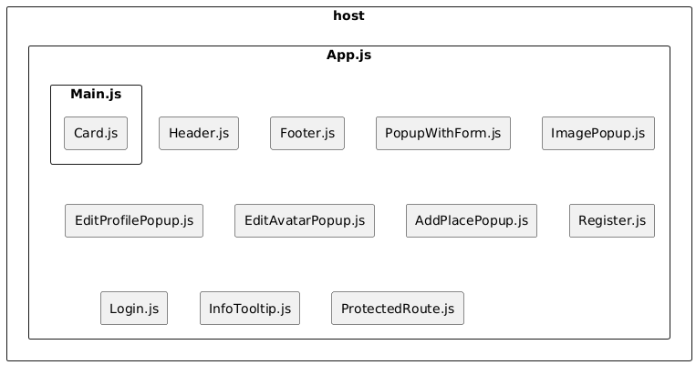
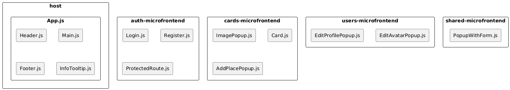

# Задание 1

## Компоненты

1. Добавление карточки с местом (AddPlacePopup.js)
2. Корень композиции (App.js)
3. Карточка места (Card.js)
4. Редактирование аватара профиля (EditAvatarPopup.js)
5. Редактирование текстовой информации профиля (EditProfilePopup.js)
6. Подвал (Footer.js)
7. Хедер (Header.js)
8. Изображение карточки (ImagePopup.js)
9. Информационная подсказка (InfoTooltip.js)
10. Форма аутентификации (Login.js)
11. Главный компонент рабочей области (Main.js)
12. Всплывающая форма (PopupWithForm.js)
13. Маршрутизация редиректа неавторизованного пользователя (ProtectedRoute.js)
14. Форма регистрации (Register.js)

В исходном решении выглядит так:



```
@startuml
skinparam componentStyle rectangle

component "host" {
   component "App.js"
}

component "App.js" {
    component "Header.js"
    component "Main.js"
    component "Footer.js"
    component "PopupWithForm.js"
    component "ImagePopup.js"
    component "EditProfilePopup.js"
    component "EditAvatarPopup.js"
    component "AddPlacePopup.js"
    component "Register.js"
    component "Login.js"
    component "InfoTooltip.js"
    component "ProtectedRoute.js"
}

component "Main.js" {
    component "Card.js"
}
@enduml
```

## Разделение на модули (микрофронтенды)

Было принято решение разбить на 4 дополнительных микрофронтенда:
1. Микрофронтенд регистрации, аутентификации и авторизации 
2. Микрофронтенд для работы с учетной записью (редактирование аватара и провиля)
3. Микрофронтенд работы с карточками (фото) (основная доменная логика)
4. Микрофронтенд для общей логики для всех
5. Хост, объединяющий все вышеуказанные микрофронтенды



http://www.plantuml.com/plantuml/uml/SyfFKj2rKt3CoKnELR1Io4ZDoSa700003

```
@startuml
skinparam componentStyle rectangle

component "host" {
   component "App.js"
}

component "auth-microfrontend" {
    component "Login.js"
    component "Register.js"
    component "ProtectedRoute.js"
}

component "users-microfrontend" {
    component "EditProfilePopup.js"
    component "EditAvatarPopup.js"
}

component "cards-microfrontend" {
    component "ImagePopup.js"
    component "Card.js"
    component "AddPlacePopup.js"
}

component "shared-microfrontend" {
    component "PopupWithForm.js"
}

component "App.js" {
    component "Header.js"
    component "Main.js"
    component "Footer.js"
    component "InfoTooltip.js"
}
@enduml
```

## Запуск

Уровень 3 не реализован. Проект на данный момент не запустится.
Для корректного запуска в Production был отредактирован compose.yaml.
Предполагается, что микрофронтенды должны общаться внутри докер сети.

## Использованный подход и разделние на микрофронтенды

Был использован подход Module Federation, т.к. он удачно ложится на структуру проекта:
- разные команды могут разрабатывать и поддерживать микрофронтенды, не мешая друг другу
- можно поэтапно заниматься разработкой каждого микрофронтенда (не обязательно сразу выносить все)
- реализовать быстро и достаточно легко
- нет необходимости миксовать разные фреймворки
- ленивая подгрузка модулей.

Для создания микрофронтендов использовалась команда `npx create-mf-app`, которая добавила все необходимые зависимости для реализации подхода Module Federation.

Единственное, что стоит отметить - пакет для реализации подхода из коробки установился rspack, а не webpack.

# Задание 2

Доступ на комментирование:

https://drive.google.com/file/d/1B1TsLEVjzEdkdhZEtoG0JHbflnTQHnPt/view?usp=sharing

Также текст из диаграммы есть в: [файлике](task2-notes.md)